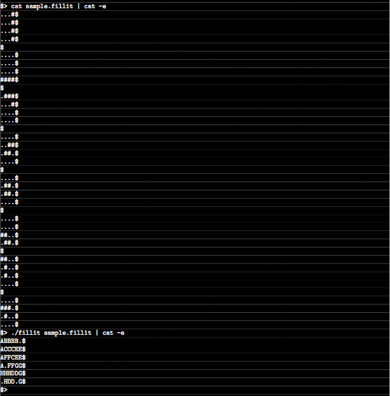

# Fillit - 42/Unit Factory

This project create program, which to rearrange a serie of tetriminos blocks from input files into the smallest possible combination in the upper left corner.

Use "make" to compile program.

